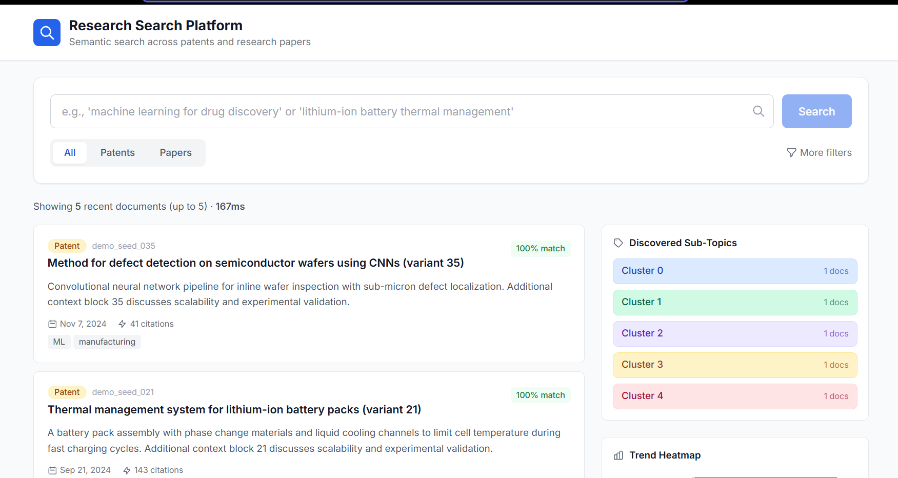
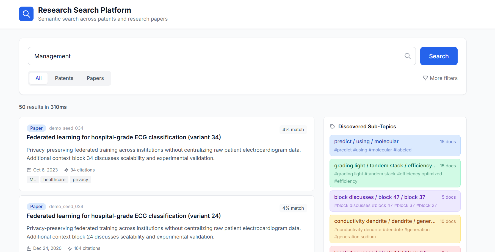

# Research Search Platform

A semantic search platform for patents and research papers. Users can enter natural language queries to find semantically similar documents, discover sub-topics via clustering, and visualize trends over time through interactive heatmaps.

## Screenshots

### Landing: recent documents (browse)

On load, the app shows up to five recent documents from the index—no query required—along with discovered sub-topics and the trend heatmap.

### Semantic search

Natural-language search returns ranked results with match scores, metadata (date, citations, tags), and clustered sub-topics.

